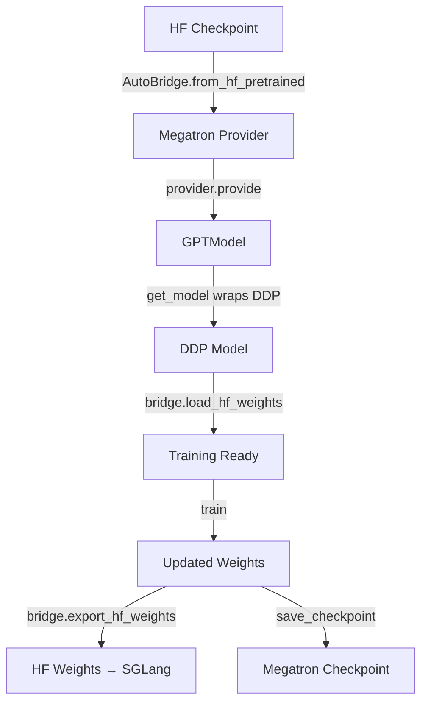
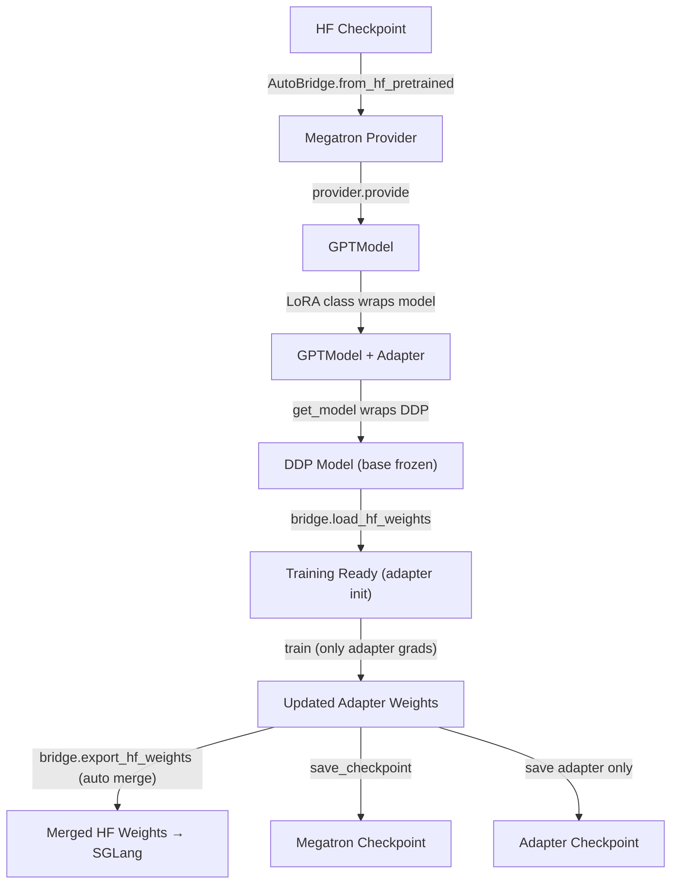

# Slime Megatron LoRA/PEFT 支持方案

## 架构总览

当前 slime 的 Megatron bridge 模式训练流程：




加入 LoRA 后的流程：




## 关键设计决策

- **LoRA 实现来源**: 使用 Megatron-Bridge 的 `LoRA` 类 (`megatron.bridge.peft.lora.LoRA`)，而非 HuggingFace `peft` 库。这与 bridge 模式的模型创建流程一致。
- **LoRA 注入时机**: 在 model provider 内部、DDP wrapping 之前。LoRA 会冻结 base 参数并添加 adapter 参数，DDP 需要知道哪些参数可训练。
- **权重更新到 SGLang**: 依赖 `bridge.export_hf_weights()` 自动将 adapter 合并到 base 权重后导出。现有的 `HfWeightIteratorBridge` 已经使用该 API，预期无需大改。
- **Checkpoint**: Megatron checkpoint 自然包含 adapter 参数（通过 `save_checkpoint` 保存所有模型参数）。额外提供 adapter-only checkpoint 用于高效保存/导出。

## 需要修改的文件和具体改动

### 1. 新增 PEFT 配置工具 (`slime/backends/megatron_utils/peft_utils.py`)

新建文件，参考 verl 的 `verl/workers/config/megatron_peft.py` 和 `verl/utils/megatron_peft_utils.py`。

核心功能：

- `get_peft_cls(args)`: 根据 args 创建 Megatron-Bridge 的 LoRA 实例
- `save_adapter_checkpoint(model, path)`: 提取并保存 adapter 参数
- `load_adapter_checkpoint(model, path)`: 加载 adapter 参数到模型
- `count_adapter_parameters(model)`: 统计 adapter 参数量

```python
from megatron.bridge.peft.lora import LoRA

def get_peft_cls(args):
    if args.lora_rank <= 0 or args.megatron_to_hf_mode != "bridge":
        return None
    return LoRA(
        target_modules=args.target_modules,
        dim=args.lora_rank,
        alpha=args.lora_alpha,
        # ...
    )
```

### 2. 修改模型创建 (`slime/backends/megatron_utils/model_provider.py`)

在 bridge 模式下，包装 `provider.provide` 以在模型创建后、DDP wrapping 前注入 LoRA：

```python
# 在 get_model_provider_func 的 bridge 分支中
if args.megatron_to_hf_mode == "bridge":
    bridge = AutoBridge.from_hf_pretrained(...)
    provider = bridge.to_megatron_provider(...)
    # ... 现有配置 ...
    provider.finalize()
    
    peft_cls = get_peft_cls(args)
    if peft_cls is not None:
        original_provide = provider.provide
        def provide_with_lora(pre_process=True, post_process=True):
            model = original_provide(pre_process, post_process)
            model = peft_cls(model, training=True)
            peft_cls.set_params_to_save(model)
            return model
        return provide_with_lora
    return provider.provide
```

注意: `wrap_model_provider_with_freeze` 在此之后执行，可以进一步冻结特定 adapter 参数（如 MoE router）。

### 3. 修改 Checkpoint 逻辑 (`slime/backends/megatron_utils/checkpoint.py`)

- **保存**: 在现有 `save_checkpoint` 后，额外保存 adapter-only checkpoint
- **加载**: 从 HF checkpoint 加载 base weights 后，若存在 adapter checkpoint 则加载

```python
def save_adapter_only(model, save_path, rollout_id):
    """Save adapter-only checkpoint alongside Megatron checkpoint."""
    adapter_dir = os.path.join(save_path, f"adapter_iter_{rollout_id:07d}")
    # 提取 adapter 参数 (名称含 ".adapter.") 并按 rank 保存
    from .peft_utils import save_adapter_checkpoint
    save_adapter_checkpoint(model, adapter_dir)

def load_adapter_if_exists(model, load_path):
    """Load adapter checkpoint if available."""
    # 扫描 load_path 下的 adapter_iter_* 目录
    from .peft_utils import load_adapter_checkpoint
    load_adapter_checkpoint(model, adapter_path)
```

### 4. 修改参数定义 (`slime/utils/arguments.py`)

调整现有 LoRA 参数的验证逻辑以支持 Megatron：

```python
# 在 slime_validate_args 中
if args.lora_rank > 0:
    if args.train_backend == "megatron":
        assert args.megatron_to_hf_mode == "bridge", "Megatron LoRA requires bridge mode"
        if args.target_modules is None or args.target_modules == "all-linear":
            # Megatron 默认 target modules
            args.target_modules = ["linear_qkv", "linear_proj", "linear_fc1", "linear_fc2"]
        elif isinstance(args.target_modules, str):
            args.target_modules = [m.strip() for m in args.target_modules.split(",")]
    else:
        # 现有 FSDP LoRA 验证逻辑不变
        ...
```

可选新增参数：

- `--lora-type`: 默认 `lora`，可选 `vlm_lora`, `canonical_lora`, `dora`
- `--lora-dropout`: 默认 `0.0`

### 5. 修改 Actor (`slime/backends/megatron_utils/actor.py`)

#### 5a. 保存 checkpoint 时额外保存 adapter

在 `save_model` 中：

```python
def save_model(self, rollout_id, force_sync=False):
    # ... 现有保存逻辑 ...
    save(rollout_id, self.model, self.optimizer, self.opt_param_scheduler)
    
    # 额外保存 adapter checkpoint
    if self.args.lora_rank > 0 and self.args.save:
        from .peft_utils import save_adapter_checkpoint
        save_adapter_checkpoint(self.model, os.path.join(self.args.save, f"adapter"))
```

#### 5b. 加载 checkpoint 时加载 adapter

在 `init` 中，`initialize_model_and_optimizer` 会调用 `load_checkpoint`。若从 HF checkpoint 加载 + 存在 adapter checkpoint：

```python
# 在 initialize_model_and_optimizer 之后
if args.lora_rank > 0 and adapter_checkpoint_exists:
    from .peft_utils import load_adapter_checkpoint
    load_adapter_checkpoint(model, adapter_path)
```

### 6. 权重更新到 SGLang - 验证/修复

当前 bridge 模式使用 `[HfWeightIteratorBridge](slime/slime/backends/megatron_utils/update_weight/hf_weight_iterator_bridge.py)`：

```python
named_weights = self._bridge.export_hf_weights(self.model, cpu=False, conversion_tasks=conversion_tasks)
```

`bridge.export_hf_weights()` 应当自动处理 LoRA adapter 的合并导出。需要验证：

1. `_process_conversion_tasks()` 能正确映射 adapter 参数名
2. `bridge.get_conversion_tasks(self.model)` 能识别带有 adapter 的模型
3. 导出的 HF 权重是 base + adapter 合并后的结果

**风险点**: 若 bridge 的 export 不自动合并 adapter，需要在权重更新前手动 merge：

```python
# 备选方案: 在 update_weights 前 merge adapter
if has_lora:
    peft_cls.merge(model)
    weights_backuper.backup("actor")
# ... update_weights ...
if has_lora:
    peft_cls.unmerge(model)
```

### 7. 修改 `model.py` 中的 `save_hf_model`

当 LoRA 启用时，`bridge.save_hf_pretrained(model, path=path)` 应导出合并后的 HF 权重。需验证此行为正确。

## 不需要改动的部分

- **训练循环** (`train_one_step`, `train`): LoRA 通过冻结 base 参数实现，optimizer 只跟踪可训练参数，训练循环无需改动
- `**TensorBackuper**`: backup/restore 机制对所有参数（包括 adapter）透明，ref 模型的 adapter 参数保持初始化状态（B=0），等效于无 adapter
- **SGLang 端**: 使用合并权重方式（非 SGLang LoRA 模式），SGLang 端不感知 LoRA

## 实现顺序

按依赖关系排序的实施步骤。
